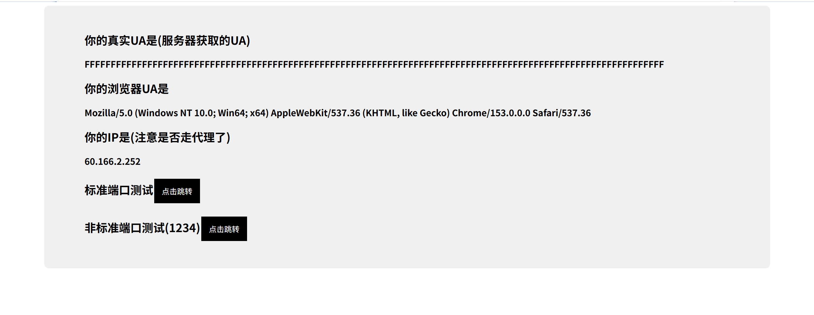

安徽邮电职业技术学院自动认证脚本+openwrt屏蔽检测多设备和时间戳,TTL

推荐使用的是openwrt.ai编译的openwrt，加入下面这些ipk后编译

ua2f luci-app-ua2f iptables-mod-nat-extra iptables-nft ip6tables-nft iptables-mod-conntrack-extra iptables-mod-filter iptables-mod-u32 iptables-mod-ipopt kmod-ipt-u32 kmod-ipt-ipopt kmod-ipt-filter kmod-ipt-nat-extra kmod-ipt-conntrack-extra

UA2F

编译时不要勾选turboacc,或者在网页关闭

UA2F勾选启用，处理 443 端口的 HTTP 流量，自动设置防火墙规则

然后打开手机连接WiFi测试打开

http://ua.233996.xyz

如果网页服务器端User-Agent显示FFFFFF，则为成功

NTP防偏移和TTL
去网页，防火墙，自定义规则粘贴 (注：我的局域网是192.168.2.0）

#DNS

iptables -t nat -A PREROUTING -p udp --dport 53 -j REDIRECT --to-ports 53

iptables -t nat -A PREROUTING -p tcp --dport 53 -j REDIRECT --to-ports 53

#NTP防偏移

iptables -t nat -N ntp_force_local

iptables -t nat -I PREROUTING -p udp --dport 123 -j ntp_force_local

iptables -t nat -A ntp_force_local -d 0.0.0.0/8 -j RETURN

iptables -t nat -A ntp_force_local -d 127.0.0.0/8 -j RETURN

iptables -t nat -A ntp_force_local -d 192.168.0.0/16 -j RETURN

iptables -t nat -A ntp_force_local -s 192.168.0.0/16 -j DNAT --to-destination 192.168.2.1

#伪装TTL为电脑。（128是电脑，64是手机设备）

iptables -t mangle -A POSTROUTING -j TTL --ttl-set 64

自动认证脚本

在root目录下创建login.sh,(可以使用TTYD，也可以使用ssh工具）

编辑login.sh

user换成你的账号，password换成你的密码，再给login.sh加一个最高权限

chmod 700 login.sh 

保存后可以运行一下在ping看能不能ping通外网

在init.d目录下在创建一个服务文件

touch /etc/init.d/autologin

主要就是路由器启动后延迟30秒在执行，然后ping阿里dns，如果超时就会触发重新认证脚本

在赋予权限和开机自动运行

chmod +x /etc/init.d/autologin

/etc/init.d/autologin enable

仅供学习，请遵守法律法规和校规，风险自负，本项目/教程所提供的所有代码、脚本、工具及思路，仅供计算机网络协议研究、OpenWrt 系统学习及技术交流使用。作者不鼓励、不支持、不参与任何形式的网络滥用或违规行为。
请在符合当地法律法规以及所在学校/单位网络管理规定的前提下使用本教程。严禁将相关技术用于商业牟利、恶意攻击、破坏网络设施或其他任何非法用途。使用本教程中的脚本或配置所产生的一切直接或间接后果（包括但不限于：校园网账号被冻结/封禁、网络被断、路由器固件损坏、硬件故障等），均由使用者本人承担，作者不承担任何责任

如果你下载、复制或使用了本仓库的任何内容，即表示你已阅读、理解并同意上述全部条款。

